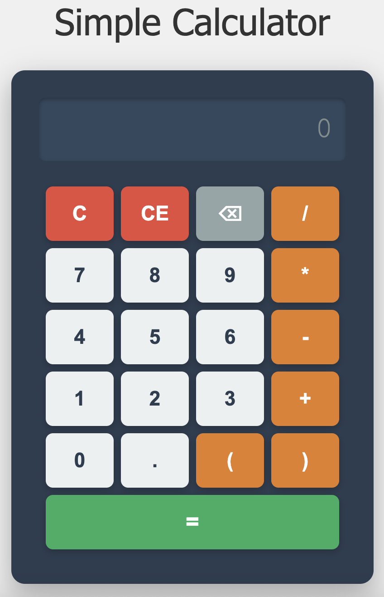

# Simple Calculator Web App

A simple web calculator built with Flask, Jinja2 templates, and HTML **without JavaScript**. All functionality is handled server-side using Flask routes and sessions. Features a modern, responsive design with CSS styling.

<div align="center">
  
  <p><em>Modern calculator interface with responsive design</em></p>
</div>

## Features

- ✅ **Basic arithmetic operations**: addition, subtraction, multiplication, division
- ✅ **Support for parentheses** and decimal numbers
- ✅ **Clear (C) and Clear Entry (CE)** functionality  
- ✅ **Backspace functionality** to delete last character
- ✅ **Error handling** for invalid expressions and division by zero
- 🎨 **Modern, responsive design** with CSS styling
- 📱 **Centered layout** with attractive visual design
- 🚀 **No JavaScript required** - pure server-side implementation
- 🔧 **Color-coded buttons** for intuitive user experience

## Setup

1. Create a virtual environment:
```bash
python3 -m venv venv
```

2. Activate the virtual environment:
```bash
source venv/bin/activate  # On macOS/Linux
# venv\Scripts\activate   # On Windows
```

3. Install dependencies:
```bash
pip install -r requirements.txt
```

## Running the Application

1. Make sure your virtual environment is activated
2. Run the application:
```bash
python app.py
```

3. Open your web browser and go to `http://127.0.0.1:5001`

> 📸 **Note**: To display the calculator screenshot in this README, save the calculator interface image as `images/calculator-screenshot.png` in your local repository.

## Usage

- Click the number and operator buttons to build your expression
- Click "=" to calculate the result
- Use "C" to clear the entire display
- Use "CE" to clear the current entry
- Use "⌫" to delete the last character
- Each button click triggers a server request and page reload (no JavaScript)

## Testing

Run all tests:
```bash
python -m pytest
```

Run tests with verbose output:
```bash
python -m pytest -v
```

Run specific test categories:
```bash
# Test basic arithmetic operations
python -m pytest tests/test_calculator.py::TestBasicArithmeticOperations -v

# Test calculator functionality (C, CE, backspace)
python -m pytest tests/test_calculator.py::TestCalculatorFunctionality -v

# Test error handling
python -m pytest tests/test_calculator.py::TestErrorHandling -v
```

## Test Coverage

The test suite includes comprehensive coverage for:

### Basic Operations
- ✅ Addition (+)
- ✅ Subtraction (-)
- ✅ Multiplication (*)
- ✅ Division (/)

### Calculator Functions
- ✅ Clear (C) - clears entire display
- ✅ Clear Entry (CE) - clears current entry
- ✅ Backspace (⌫) - deletes last character

### Advanced Features
- ✅ Parentheses operations
- ✅ Decimal number support
- ✅ Sequential calculations
- ✅ Error handling and recovery

### Error Scenarios
- ✅ Division by zero
- ✅ Invalid characters
- ✅ Malformed expressions
- ✅ Empty expressions
- ✅ Server-side validation

## Running the Application

1. Make sure your virtual environment is activated
2. Run the application:
```bash
python app.py
```

3. Open your web browser and go to `http://127.0.0.1:5000`

## Usage

- Click the number and operator buttons to build your expression
- Click "=" to calculate the result
- Use "C" to clear the entire display
- Use "CE" to clear the current entry
- Use "⌫" to delete the last character
- Each button click triggers a server request and page reload (no JavaScript)
- **Modern interface** with responsive design that works on all devices

## Error Handling

The calculator handles common errors server-side:
- Invalid expressions (malformed syntax)
- Division by zero
- Invalid characters in input
- Empty expressions
- Server-side validation and sanitization
- **Visual error feedback** with styled error messages

## Project Structure

```
calculator-app/
├── app.py              # Main Flask application (server-side logic)
├── templates/
│   └── calculator.html # Calculator interface template (Jinja2)
├── static/
│   └── styles.css      # CSS styles for modern design
├── tests/              # Test suite
│   ├── __init__.py     # Tests package init
│   ├── conftest.py     # Test configuration and fixtures
│   └── test_calculator.py    # Comprehensive unit tests
├── requirements.txt    # Python dependencies
├── pyproject.toml     # pytest configuration
└── README.md          # This file
```

## Technical Implementation

### Server-Side Architecture
- **Flask routes** handle all calculator operations
- **Sessions** maintain calculator state between requests
- **Jinja2 templates** render dynamic content
- **Static CSS files** provide modern, responsive styling
- **URL encoding** handles special characters (+, /, etc.)
- **No JavaScript** - pure server-side implementation

### Design Features
- **Centered layout** with flexbox positioning
- **Responsive design** that works on mobile and desktop
- **Modern color scheme** with professional appearance
- **Button hover effects** and smooth animations
- **Error message styling** with clear visual feedback
- **Typography** optimized for readability

### Route Structure
- `GET /` - Main calculator page
- `GET /input?value=X` - Add digit/operator to expression
- `GET /calculate` - Evaluate expression and show result
- `GET /clear` - Clear entire display
- `GET /clear_entry` - Clear current entry
- `GET /backspace` - Delete last character

## Error Handling

The calculator handles common errors:
- Invalid expressions
- Division by zero
- Invalid characters in input
- Server errors
